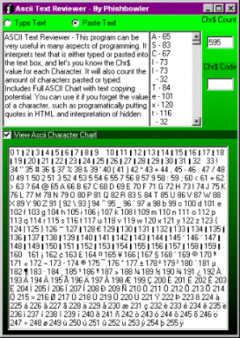



## ASCII Text Reviewer

### Description

ASCII Text Reviewer - This program can be very useful in many aspects of programming. It interprets text that is either typed or pasted into the text box, and let's you know the Chr$ value for each Character. It will also count the amount of characters pasted or typed. Includes Full ASCII Chart with text copying potential. You can use it if you forget the value of a character, such as programatically putting quotes in HTML and interpretation of hidden characters. Chr's like 10, 13, and 9. Keep a short-cut to it on the desktop to avoid having to look up Chr's on a hard to find ASCII Chart.
 
### More Info
 

             |
---                |---
**Submitted On**   |2000-09-30 14:05:26
**By**             |[Phishbowler](https://github.com/Planet-Source-Code/PSCIndex/blob/master/ByAuthor/phishbowler.md)
**Level**          |Beginner
**User Rating**    |4.8 (24 globes from 5 users)
**Compatibility**  |VB 4\.0 \(32\-bit\), VB 5\.0, VB 6\.0
**Category**       |[Coding Standards](https://github.com/Planet-Source-Code/PSCIndex/blob/master/ByCategory/coding-standards__1-43.md)
**World**          |[Visual Basic](https://github.com/Planet-Source-Code/PSCIndex/blob/master/ByWorld/visual-basic.md)
**Archive File**   |[ASCII Text22150732001\.zip](https://github.com/Planet-Source-Code/phishbowler-ascii-text-reviewer__1-11465/archive/master.zip)

